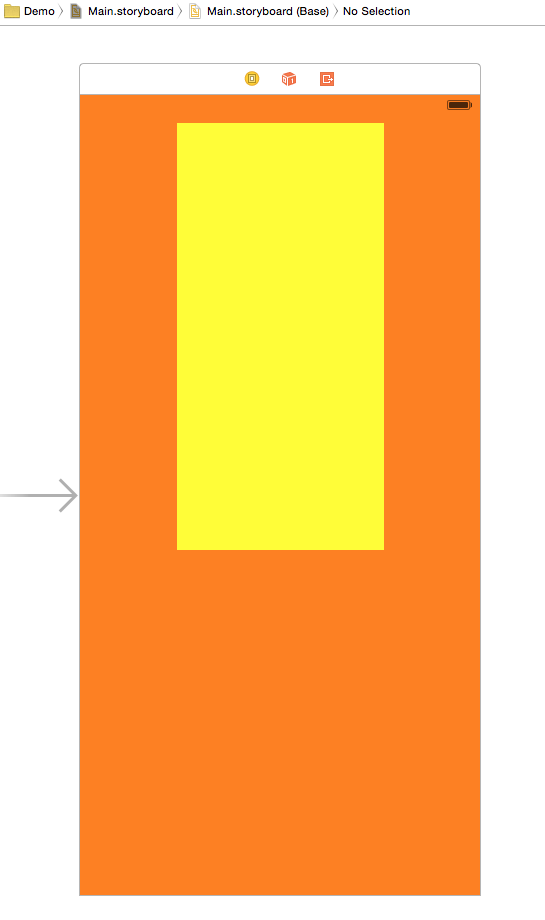
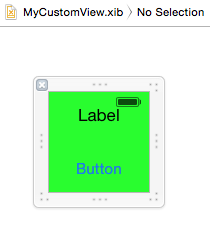
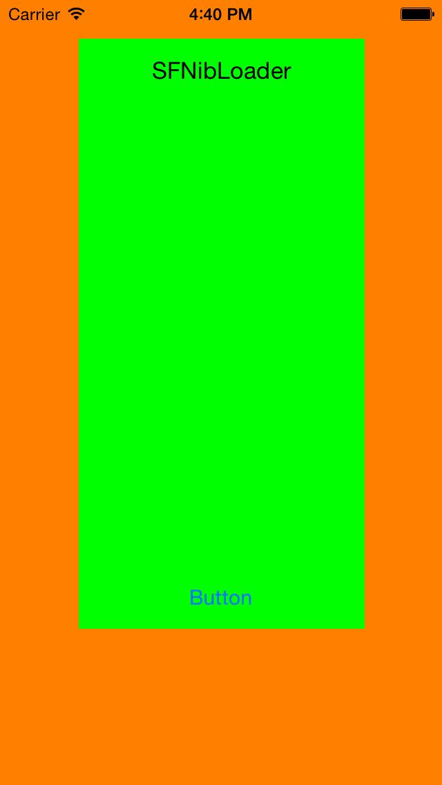

# SFNibLoader
Load your custom view (XIB) in your storyboard.

### Installation:

- Manually: Copy the `SFNibLoader` class into your project.
- CocoaPods: (Soon available)

### Usage:

In your `UIViewController` class, import:

```
#import "SFNibLoader.h"
```

Interface with the `UIView` you created in the storyboard:

```
@property (weak, nonatomic) IBOutlet UIView *myView;
```

And in the `viewDidLoad` method:

```
[SFNibLoader loadNibNamed:@"MyCustomViewNibName" inView:self.myView];
```

### Result:




